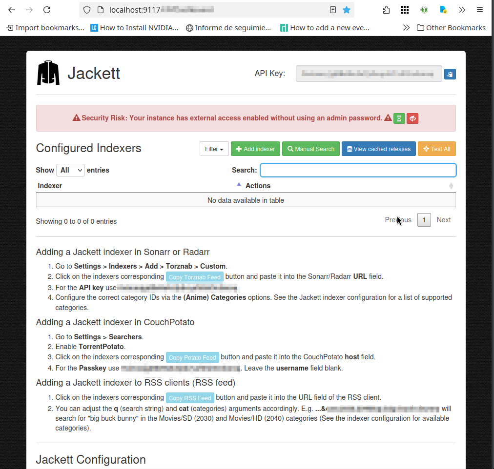
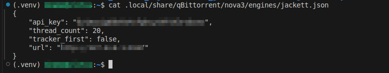

# qBittorrent + servidores de búsqueda con Jackett en Linux

## Supuestos cumplidos

> Sistema operativo: Tuxedo Linux basado en Ubuntu 24.04LTS

## Detalle/resumen de sesión trabajo

### Instalación de qBittorrent

```bash
sudo nala install qbittorrent
```

### qBittorrent

Habilíto `Search Engine`

- "qBittorrent > View > Search Engine"

En la ventana que aparece (en la esquina inferior derecha) `Search plugin`

- `> Search plugins...`
- `> Check for updates`

### Instalación de Jackett

**URL:**

- [Jackett](https://github.com/Jackett/Jackett)
- [Jackett releases](https://github.com/Jackett/Jackett/releases)

De Jacket releases descargo la última estable, e instalo (descomprimo y configuro).

```bash
wget https://github.com/Jackett/Jackett/releases/download/v0.22.1874/Jackett.Binaries.LinuxAMDx64.tar.gz
mkdir ~/.dz-installers
tar xvzf Jackett.Binaries.LinuxAMDx64.tar.gz -C ~/.dz-installers/
cd ~/.dz-installers/Jackett/
sudo ./install_service_systemd.sh
```

_Nota:_ Por defecto Jacket se instala (y hábilita) como servicio del sistema (`systemctl status Jackett`). En esta ahora instalación se dejará detenido/deshabilitado y será gestionado con un script que se utilizará cuando se use en este sistema.

```bash
# Deshabilitar el servicio
sudo systemctl disable --now jackett
```

#### Configuración de jackett

En este apartado se ejecuta Jackett y se configura para con qbittorrent

```bash
sudo systemctl start jackett
```

En `http://localhost:9117` esta disponible la UI Weg de Jackett. En esa interface:

- Establecer una contraseña para la propia aplicación
- Copiar el API Key que la aplicación ha generado



La configuración consiste en que en el fichero `jackett.json` es ingresar el API KEY copiado antes. Esto se puede hacer ejecutando:

```bash
find ~ -iname 'jackett.json'
```



## Referencias consultadas

- [Instala qBittorrent y Agrega Servidores de Búsqueda con Jackett en Linux](https://youtu.be/vexJvZ7SL1E?si=B-r0wUryibtlgeqH) #Youtube/video